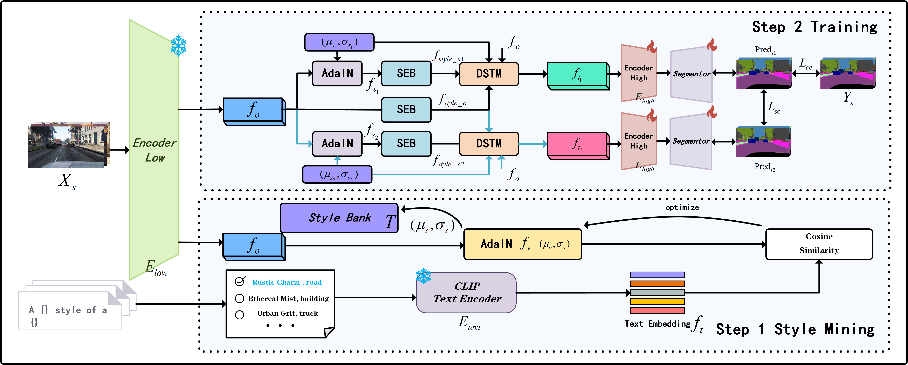
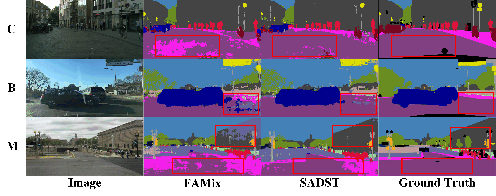
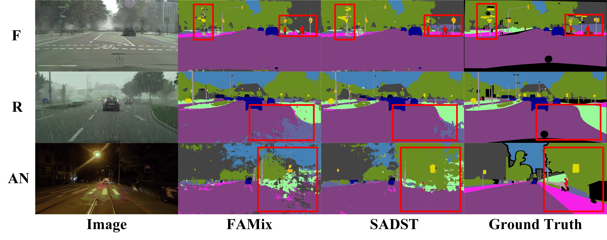

# SADST: Style-Aware Dynamic Style Transfer for Domain Generalized Semantic Segmentation
This repository provides the official PyTorch implementation of the following paper:

> **Abstract:**
> *Domain Generalized Semantic Segmentation (DGSS) aims to generalize models trained on a single source domain to unseen target domains. The generalization performance of a model is severely hindered by significant style discrepancies between domains, such as variations in texture and illumination. While existing DGSS methods employ style transfer to alleviate these discrepancies, their fixed or random transfer strategies overlook the intricate interplay between content and style. This often leads to over-stylization, which in turn causes a loss of semantic information, consequently degrading generalization on unseen domains. To overcome this limitation, we introduce a novel approach, Style-Aware Dynamic Style Transfer (SADST). Our method consists of three key components: (1) The Style Extraction Block (SEB) extracts style information from low-level features that preserves crucial semantic cues for guiding the subsequent transfer task. (2) The Dynamic Style Transfer Module (DSTM) dynamically predicts the intensity of the style transfer by considering the style information of both the original and stylized features. (3) A Style-Semantic Consistency Loss is introduced to ensure that different stylized versions of the same feature yield identical segmentation results, compelling the model to learn style-invariant representations. Experiments conducted on several DGSS baselines show that SADST outperforms current state-of-the-art methods. The code is available at https://github.com/Sinkalex/SADST.*

<p align="center">
  
</p>

We advise you to use conda environment to run the package. Run the following command to install all the necessary modules:

```
Code will coming soon
```


```sh
conda env create -f SADST-env.yml 
conda activate SADST
```


### How to Run SADST
We trained the model on [GTAV](https://download.visinf.tu-darmstadt.de/data/from_games/)
We evaluated the model on [Cityscapes](https://www.cityscapes-dataset.com/), [BDD-100K](https://bair.berkeley.edu/blog/2018/05/30/bdd/), [Synthia](https://synthia-dataset.net/downloads/) ([Foggy Cityscapes](http://synthia-dataset.net/download/808/)), [Rain Cityscapes](https://www.cityscapes-dataset.com/) and [Mapillary](https://www.mapillary.com/dataset/).


1. For Cityscapes dataset, download "leftImg8bit_trainvaltest.zip" and "gtFine_trainvaltest.zip" from https://www.cityscapes-dataset.com/downloads/<br>
Unzip the files and make the directory structures as follows.
```
Cityscapes
 └ leftImg8bit_trainvaltest
   └ leftImg8bit
     └ train
     └ val
     └ test
 └ gtFine_trainvaltest
   └ gtFine
     └ train
     └ val
     └ test
```
1. For BDD-100k dataset, download  from https://www.mapillary.com/dataset/<br>
Unzip the files and make the directory structures as follows.
```
BDD-100k
 └ images
   └ train
   └ val
   └ test
 └ labels
   └ train
   └ val
```
1. For Mapillary dataset, download  from https://bair.berkeley.edu/blog/2018/05/30/bdd/<br>
```
Mapillary
 └ training
   └ images
   └ labels
 └ validation
   └ images
   └ labels
 └ test
   └ images
   └ labels
```
### Routine Scenario Generalization Visualization
<p align="center">
  
</p>


1. For Rain_Cityscapes dataset, download from https://www.cityscapes-dataset.com/downloads/<br>
Unzip the files and make the directory structures as follows.
```
Rain_Cityscapes
 └ leftImg8bit_trainvaltest
   └ leftImg8bit
     └ train
     └ val
     └ test
 └ gtFine_trainvaltest
   └ gtFine
     └ train
     └ val
     └ test
```
1. For Foggy_Cityscapes dataset, download  from https://www.cityscapes-dataset.com/downloads/<br>
Unzip the files and make the directory structures as follows.
```
Foggy_Cityscapes
 └ leftImg8bit_trainvaltest
   └ leftImg8bit
     └ train
     └ val
     └ test
 └ gtFine_trainvaltest
   └ gtFine
     └ train
     └ val
     └ test
```


### Enhanced Scenario Generalization Visualization
<p align="center">
  
</p>